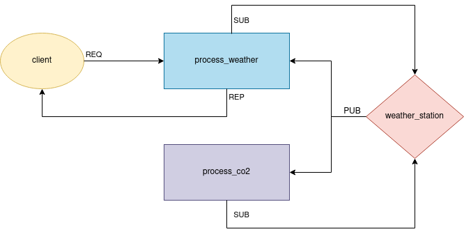

# ZeroMQ

> Distributed and Networking Programming - Spring 2024

## Overview

this code is to organize a (simple) real-time distributed Weather Data Management system using the [ZeroMQ](https://zguide.zeromq.org/docs/chapter1/).

## System Architecture



- **Weather Station (`weather_station.py`)**:
  - Generates random humidity and temperature levels every 2 seconds, with temperature ranging from 5 to 40°C and humidity ranging from 40 to 100%.
  - Formats the weather data as a JSON string, including a timestamp.
  - Generates random CO2 level rangin from 300 to 500 parts per million, ppm.
  - Formats the CO2 data as a JSON string, including a timestamp.
  - Sends the generated data to the "weather and CO2 processing" servers via ZeroMQ, using a PUB socket bound to a specified address.
  - Continuously operates unless interrupted by a keyboard interrupt.
  - Example message for Weather data: `weather {"time": "2024-03-31 17:51:39", "temperature": 28.8, "humidity": 75.2}`
  - Example message for CO2 data: `co2 {"time": "2024-04-02 02:44:28", "co2": 354.3}`
  - You can wait for 2 seconds between sending these messages.
  - If you faced an issue that the first data is not received on the server, please use 2 sec sleep in the begining of your while loop.

- **Weather Processing Server (`process_weather.py`)**:
  - Subscribes to data from weather stations via ZeroMQ and only receives data with option= "weather". For example you can use like `setsockopt_string(zmq.SUBSCRIBE, "weather")`
  - Logs the received data in `weather_data.log`.
  - Computes the average temperature and humidity of the `last 30 seconds` to use later.
  - Reply to client based on the average data that you compute when he requests for either weather information or suitable clothing recommendations.
  - If a client requests "Fashion", provides a recommendation based on the last saved average temperature:
    - If the average is less than `10°C`, suggests wearing warm clothes.
    - If the average is between 10°C and `25°C`, suggests spring/autumn clothes.
    - If the average is above `25°C`, recommends wearing light clothes.
  - If a client requests "Weather", sends the last saved temperature and humidity values.
  - If the request is neither of those, reply with `Query Not Found`
  - Implement this server using threads:
    - Since client may send requests in different times, and data from data proccessing server is coming nonstop, this part implemented with threads.
    - Create 2 threads 1 for accepting client queries and and for receiving weather datas to handle this situation.

- **CO2 Processing Server (`process_co2.py`)**:
  - Subscribes to data from weather stations via ZeroMQ and only receives data with option= "co2".
  - Logs the received data in `co2_data.log`.
  - Check if the amount of CO2 is higher than 400, `print("Danger Zone! Please do not leave home")`

- **Client (`client.py`)**:
  - Requests weather information and suitable clothing recommendations from the reporter.
  - Continuously operates unless interrupted by a keyboard interrupt.
  - Prompts the user to enter a query (either "Fashion" or "Weather").
  - Sends the entered query to the appropriate service (Fashion or Weather).
  - Receives and displays the response from the service.
  - Alerts the user if the entered query is invalid and prompts for a valid input.


## Example Run

```bash
$ python weather_station.py 
Weather is sent from WS1 {"time": "2024-04-02 03:24:40", "temperature": 23.3, "humidity": 74.2}
CO2 is sent from WS1 {"time": "2024-04-02 03:24:42", "co2": 461.7}
Weather is sent from WS1 {"time": "2024-04-02 03:24:44", "temperature": 35.0, "humidity": 90.1}
CO2 is sent from WS1 {"time": "2024-04-02 03:24:46", "co2": 350.2}
Weather is sent from WS1 {"time": "2024-04-02 03:24:48", "temperature": 23.8, "humidity": 77.0}
CO2 is sent from WS1 {"time": "2024-04-02 03:24:50", "co2": 337.3}
Weather is sent from WS1 {"time": "2024-04-02 03:24:52", "temperature": 11.6, "humidity": 76.6}
CO2 is sent from WS1 {"time": "2024-04-02 03:24:54", "co2": 388.7}
Weather is sent from WS1 {"time": "2024-04-02 03:24:56", "temperature": 10.5, "humidity": 73.7}
CO2 is sent from WS1 {"time": "2024-04-02 03:24:58", "co2": 310.4}
Weather is sent from WS1 {"time": "2024-04-02 03:25:00", "temperature": 9.3, "humidity": 59.1}
CO2 is sent from WS1 {"time": "2024-04-02 03:25:02", "co2": 481.1}
Weather is sent from WS1 {"time": "2024-04-02 03:25:04", "temperature": 34.7, "humidity": 47.9}
CO2 is sent from WS1 {"time": "2024-04-02 03:25:06", "co2": 477.0}
Weather is sent from WS1 {"time": "2024-04-02 03:25:08", "temperature": 7.4, "humidity": 44.6}
CO2 is sent from WS1 {"time": "2024-04-02 03:25:10", "co2": 344.8}
Weather is sent from WS1 {"time": "2024-04-02 03:25:12", "temperature": 13.5, "humidity": 46.5}
CO2 is sent from WS1 {"time": "2024-04-02 03:25:14", "co2": 427.5}
^CTerminating weather station
```

```bash
$ python process_weather.py 
Received weather data: weather {"time": "2024-04-02 03:24:40", "temperature": 23.3, "humidity": 74.2}
Received weather data: weather {"time": "2024-04-02 03:24:44", "temperature": 35.0, "humidity": 90.1}
Received weather data: weather {"time": "2024-04-02 03:24:48", "temperature": 23.8, "humidity": 77.0}
The last 30 sec average Temperature is 27.37 and Humidity 80.43
Received weather data: weather {"time": "2024-04-02 03:24:52", "temperature": 11.6, "humidity": 76.6}
Received weather data: weather {"time": "2024-04-02 03:24:56", "temperature": 10.5, "humidity": 73.7}
Received weather data: weather {"time": "2024-04-02 03:25:00", "temperature": 9.3, "humidity": 59.1}
Received weather data: weather {"time": "2024-04-02 03:25:04", "temperature": 34.7, "humidity": 47.9}
Received weather data: weather {"time": "2024-04-02 03:25:08", "temperature": 7.4, "humidity": 44.6}
Feel free to wear spring/autumn clothes
Received weather data: weather {"time": "2024-04-02 03:25:12", "temperature": 13.5, "humidity": 46.5}
```

```bash
$ python process_co2.py 
Received weather data: co2 {"time": "2024-04-02 03:24:42", "co2": 461.7}
Danger Zone! Please do not leave home
Received weather data: co2 {"time": "2024-04-02 03:24:46", "co2": 350.2}
Received weather data: co2 {"time": "2024-04-02 03:24:50", "co2": 337.3}
Received weather data: co2 {"time": "2024-04-02 03:24:54", "co2": 388.7}
Received weather data: co2 {"time": "2024-04-02 03:24:58", "co2": 310.4}
Received weather data: co2 {"time": "2024-04-02 03:25:02", "co2": 481.1}
Danger Zone! Please do not leave home
Received weather data: co2 {"time": "2024-04-02 03:25:06", "co2": 477.0}
Danger Zone! Please do not leave home
Received weather data: co2 {"time": "2024-04-02 03:25:10", "co2": 344.8}
Received weather data: co2 {"time": "2024-04-02 03:25:14", "co2": 427.5}
Danger Zone! Please do not leave home
^CTerminating data_processor
```

```bash
$ python client.py 
Enter your query (Fashion/Weather): Weather
Sending query: Weather
Received response: The last 30 sec average Temperature is 27.37 and Humidity 80.43
Enter your query (Fashion/Weather): sth   
Invalid query. Please enter 'Fashion' or 'Weather'.
Enter your query (Fashion/Weather): Fashion
Sending query: Fashion
Received response: Feel free to wear spring/autumn clothes
Enter your query (Fashion/Weather): ^CTerminating client
```
